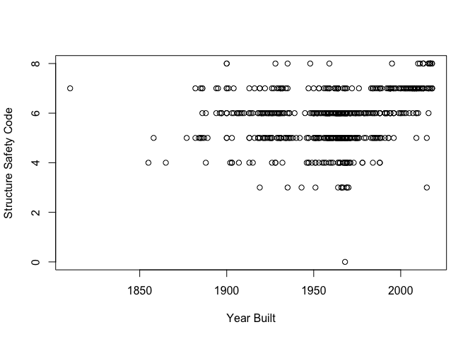

bridges\_hmwk
================

## R Markdown

``` r
#Rhode Island Bridges 
#make a file with bridge ID, year, fips codes, condition ratings, and a few other variables.
code = read_delim(file = "https://www.fhwa.dot.gov/bridge/nbi/2019/delimited/RI19.txt", delim=",", col_names = T)
```

    ## 
    ## ── Column specification ────────────────────────────────────────────────────────
    ## cols(
    ##   .default = col_double(),
    ##   STRUCTURE_NUMBER_008 = col_character(),
    ##   ROUTE_NUMBER_005D = col_character(),
    ##   HIGHWAY_DISTRICT_002 = col_character(),
    ##   COUNTY_CODE_003 = col_character(),
    ##   PLACE_CODE_004 = col_character(),
    ##   FEATURES_DESC_006A = col_character(),
    ##   CRITICAL_FACILITY_006B = col_logical(),
    ##   FACILITY_CARRIED_007 = col_character(),
    ##   LOCATION_009 = col_character(),
    ##   LRS_INV_ROUTE_013A = col_character(),
    ##   LONG_017 = col_character(),
    ##   MAINTENANCE_021 = col_character(),
    ##   OWNER_022 = col_character(),
    ##   FUNCTIONAL_CLASS_026 = col_character(),
    ##   DESIGN_LOAD_031 = col_character(),
    ##   RAILINGS_036A = col_character(),
    ##   TRANSITIONS_036B = col_character(),
    ##   APPR_RAIL_036C = col_character(),
    ##   APPR_RAIL_END_036D = col_character(),
    ##   NAVIGATION_038 = col_character()
    ##   # ... with 33 more columns
    ## )
    ## ℹ Use `spec()` for the full column specifications.

``` r
#Convert to date frame and cleans it up a little, 
#picking columns we want and renaming them for more clarity.
df = as.data.frame(code)
keep = c("STATE_CODE_001", "COUNTY_CODE_003", "FEATURES_DESC_006A", "YEAR_BUILT_027", 
         "TRAFFIC_LANES_ON_028A","DECK_COND_058", "SUPERSTRUCTURE_COND_059", "SUBSTRUCTURE_COND_060" )
df.update = df[keep]
names(df.update)[names(df.update) == "STATE_CODE_001"] <- "STATE_CODE"
names(df.update)[names(df.update) == "COUNTY_CODE_003"] <- "COUNTY_CODE"
names(df.update)[names(df.update) == "FEATURES_DESC_006A"] <- "FEATURES_DESC"
names(df.update)[names(df.update) == "YEAR_BUILT_027"] <- "YEAR_BUILT"
names(df.update)[names(df.update) == "TRAFFIC_LANES_ON_028A"] <- "#_TRAFFIC_LANES"
names(df.update)[names(df.update) == "STATE_CODE_001"] <- "STATE_CODE"
names(df.update)[names(df.update) == "DECK_COND_058"] <- "DECK_COND"
names(df.update)[names(df.update) == "SUPERSTRUCTURE_COND_059"] <- "SUP_STRUCTURE_COND"
names(df.update)[names(df.update) == "SUBSTRUCTURE_COND_060"] <- "SUB_STRUCTURE_COND"
head(df.update)
```

    ##   STATE_CODE COUNTY_CODE     FEATURES_DESC YEAR_BUILT #_TRAFFIC_LANES DECK_COND
    ## 1         44         005 'COASTERS HARBOR'       1982               2         6
    ## 2         44         005 'COASTERS HARBOR'       2010               2         7
    ## 3         44         007  'PAWTUXET RIVER'       1918               4         N
    ## 4         44         003          'AMTRAK'       2006               5         7
    ## 5         44         009      'HUNT RIVER'       1964               2         6
    ## 6         44         009          'AMTRAK'       2004               4         7
    ##   SUP_STRUCTURE_COND SUB_STRUCTURE_COND
    ## 1                  6                  6
    ## 2                  7                  6
    ## 3                  5                  6
    ## 4                  6                  7
    ## 5                  6                  5
    ## 6                  7                  7

``` r
#lets plot some data looking at yeasr built and the substructure code 
#some bridges have "N" as a structure code and this is why NAs are produced when plotting. 
#Codes meaning: 9 - excellent, 8 - very good, 7 - good, 6 - satisfactory, 5- fair, 4 - poor, 
#3 - serious, 2 - critical, 1 - imminent failure, 0 - failed N - not applicable.
plot(df.update$YEAR_BUILT, df.update$SUB_STRUCTURE_COND, xlab = "Year Built", ylab = "Structure Safety Code")
```

    ## Warning in xy.coords(x, y, xlabel, ylabel, log): NAs introduced by coercion

<!-- -->

``` r
#Interesting to see, we can see most bridges have a good rating, but there are some 3s. 
#It looks like a lot of bridges with acceptable ratings were made from 1950s to 2000s.
#However, it looks like half of the bridges that have poor scores of 3 were made during this time frame as well. 
```
